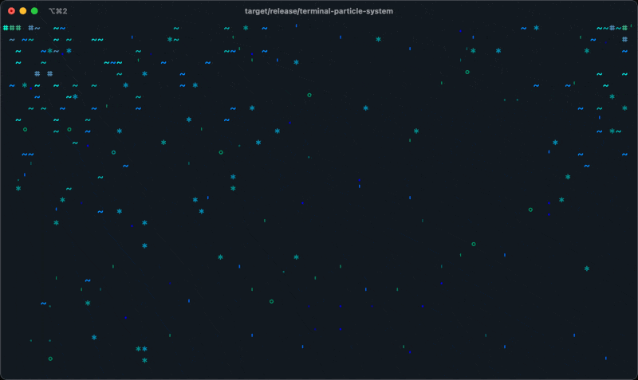

# A Particle System in the terminal



Proof-of-concept of a particle system rendered to the terminal. This assumes your terminal supports 256 (8-bit) colors.

Before running this, I recommend hiding the caret to avoid flickering as it moves around and redraws the screen. You 
can hide it with the command below:

```sh
tput civis
```

